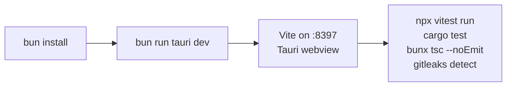
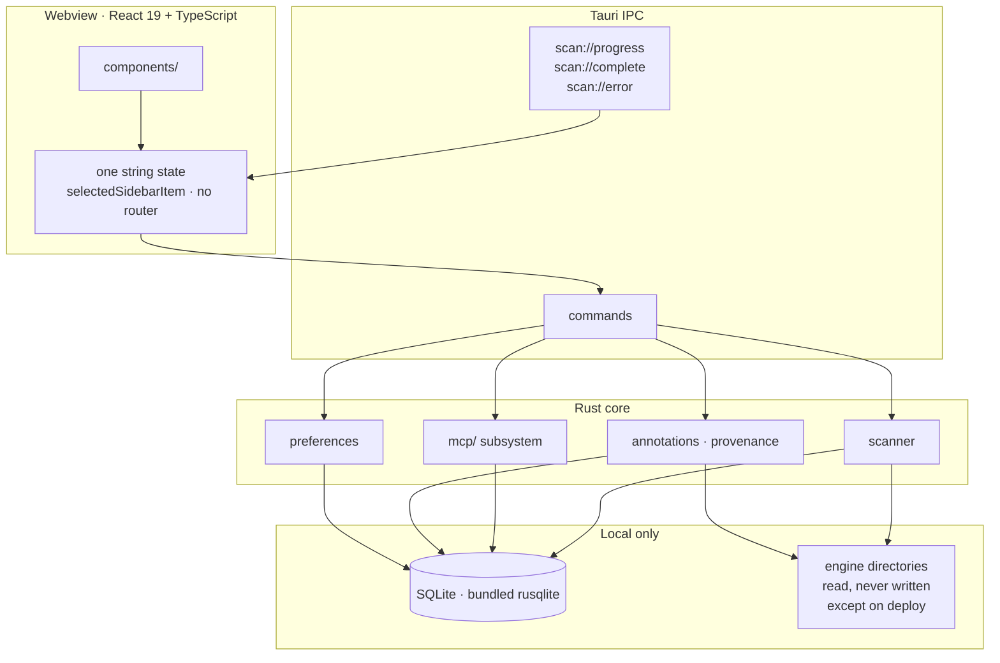

# Hanger AI

An interface for the agent harness — the skills, rules, subagents and MCP
servers that decide what your engines can actually do. Hanger is a local-first
macOS app that inventories, monitors and deploys them: it walks the
directories your engines read from, records what it finds in a local SQLite
store, and adds two facts nothing on disk keeps — which engines reach each
asset and through which path, and how far past your global store it has
spread.

Why the harness needs an interface: [Hanger](https://www.rkarthik.co/work/hanger).
How this app models it: [docs/harness.md](docs/harness.md).

![IMAGE — main inventory view]

## Quick Start



```bash
bun install            # frontend dependencies
bun run tauri dev      # the app, Vite pinned to port 8397
bun run tauri build    # production bundle
```

The port is pinned with `strictPort` because Tauri loads it by absolute URL —
a floating port breaks `tauri dev`. Prerequisites, environment variables and
storage locations: [docs/setup.md](docs/setup.md).

## How It Works

A scan writes rows. Reach and link state are not among them — those are
worked out again every time you look.

```mermaid
sequenceDiagram
    participant D as Engine directories
    participant W as Walk
    participant S as SQLite
    participant R as Read-time derivation
    participant U as Webview

    D->>W: ~/.claude, ~/.codex, a project's own .claude/
    Note over W: .gitignore respected;<br/>node_modules and credentials never read
    W->>S: assets, roots, engines, links
    Note over S: scan://progress, then scan://complete
    U->>R: get_inventory, get_asset_annotations
    R->>S: stored rows
    R->>D: stat the destination
    R-->>U: reach, and link state
    Note over R: link state is never stored —<br/>linked, drifted or dangling is<br/>recomputed on every read
```

The `links` table has a `mechanism` column and no `state` column. Whether a
link is linked, drifted or dangling is recomputed from the filesystem each
time it is read, so a file you change outside Hanger is never reported from a
cache.

The model this encodes — ownership is exclusive, reach is not — is
[docs/harness.md](docs/harness.md). The walk itself, including what it refuses
to open, is [docs/scanning.md](docs/scanning.md).

## Architecture



Views switch on one string of state rather than a router. Counts come from the
backend and never the webview: `count_assets` is the single source for every
figure on screen, and
[no-frontend-counting](src/__tests__/no-frontend-counting.test.ts) fails any
`.length` that reimplements it.

Schema changes are `PRAGMA user_version` migrations in
`preferences.rs::init_db` — no `.sql` files, no migration directory, and
`src-tauri/tests/store_migration_tests.rs` pins every version.

## Asset coverage

Hanger models what it finds as four kinds — skills, rules, subagents and MCP
servers. Why those four and not others: [docs/harness.md](docs/harness.md).

<!-- hanger:counts:start -->

| What | Count | Where it is written down |
|---|---:|---|
| Engines with directories of their own | 11 | `src-tauri/src/agents.rs` → `AGENT_CONFIGS` |
| MCP hosts | 16 | `src-tauri/src/mcp/registry.rs` → `HOSTS` |
| Tauri commands | 42 | `src-tauri/src/lib.rs` → `generate_handler!` |
| Frontend test files | 74 | `src/__tests__/` |
| Rust test files | 44 | `src-tauri/tests/` |

**Engines with directories of their own.** Claude Code, Codex, Gemini / Antigravity, Kiro, Trae, OpenCode, Amp, Zed, Roo Code, Kilo Code and Cline.

**MCP hosts.** Claude Code, Codex, Gemini / Antigravity, Claude Desktop, VS Code, Cursor, Devin Desktop, Zed, Claude.ai, Kiro, Trae, OpenCode, Amp, Roo Code, Kilo Code and Cline.

<!-- hanger:counts:end -->

Those figures are generated from the tables that define them, never typed.
Regenerate with `bun run src/__tests__/readmeCounts.ts`.

Engines and hosts are counted separately because they answer different
questions. A host is not always an engine: Claude Desktop and VS Code declare
MCP servers without owning skills or rules. Ownership and reach are separate
questions too, and the distinction matters before changing either table.

## Testing

Four gates, run from the repo root. A result is only valid for the tree at the
moment it ran.

```bash
npx vitest run                  # frontend suite
cd src-tauri && cargo test      # backend suite
bunx tsc --noEmit               # types
gitleaks detect --source .      # and --no-git -c .gitleaks.toml
```

Beyond the suites, a class of tests guards the repository's own rules. Each
fails the build rather than leaving a comment for someone to notice.

| Guard | Forbids |
|---|---|
| [no-frontend-counting](src/__tests__/no-frontend-counting.test.ts) | Counting in the webview. Counts come from `count_assets`. |
| [no-off-token-styles](src/__tests__/no-off-token-styles.test.ts) | Raw hex, Tailwind colour and radius scales, retired tokens. |
| [no-blocking-dialogs](src/__tests__/no-blocking-dialogs.test.ts) | `window.confirm`, `alert` and `prompt` anywhere in `src/`. |
| [type-roles](src/__tests__/type-roles.test.ts) | Re-declaring a text role instead of importing it. |
| [brand-coverage](src/__tests__/brand-coverage.test.ts) | An engine or host the backend can name with no mark drawn for it. |
| [design-system-coverage](src/__tests__/design-system-coverage.test.ts) | A component with no specimen on the Design system page. |
| [readme-sync](src/__tests__/readme-sync.test.ts) | This README drifting from the code it describes. |

## Design Decisions

Six choices a change could break without any test obviously failing. The full
set, each with the code that makes it true, is
[.claude/rules/invariants.md](.claude/rules/invariants.md).

> **Counts come from the backend.** One function, `count_assets`, is the
> source for every count on screen. A `.length` over a filtered array in the
> webview is a counting implementation, and is rejected.

> **Link state is derived at read time.** There is no cached `state` column.
> Linked, drifted or dangling is recomputed from the filesystem on every read.

> **Schema changes are `PRAGMA user_version` migrations.** No `.sql` files, no
> migration directory. The tests pin every version.

> **Styling is semantic tokens only.** No raw hex, no `text-red-500`. The
> token set is [.claude/DESIGN.md](.claude/DESIGN.md).

> **No blocking webview dialogs.** Native dialogs are allowed, and aliased at
> the import so call sites stay distinguishable.

> **Asset reaping is off by default.** It caused data loss twice, when
> transient unmounts and interrupted walks made live assets look stale.
> Enabling it is at your own risk:
>
> ```bash
> HANGER_ENABLE_REAP=1 /Applications/Hanger\ AI.app/Contents/MacOS/Hanger\ AI
> ```

## Installation

Download the latest `.dmg` from the
[Releases](https://github.com/k97/hanger-ai/releases) page, open the disk
image, and drag Hanger AI into your Applications folder. It is a universal
binary — Apple silicon and Intel.

## Platform support

macOS only, deliberately, until the app is stable and usable on one platform.
Adding one is not a matter of relaxing a `cfg`: what actually assumes macOS
today, and what a second platform would need, is
[docs/platforms.md](docs/platforms.md).

Licensed under the [MIT License](LICENSE).
