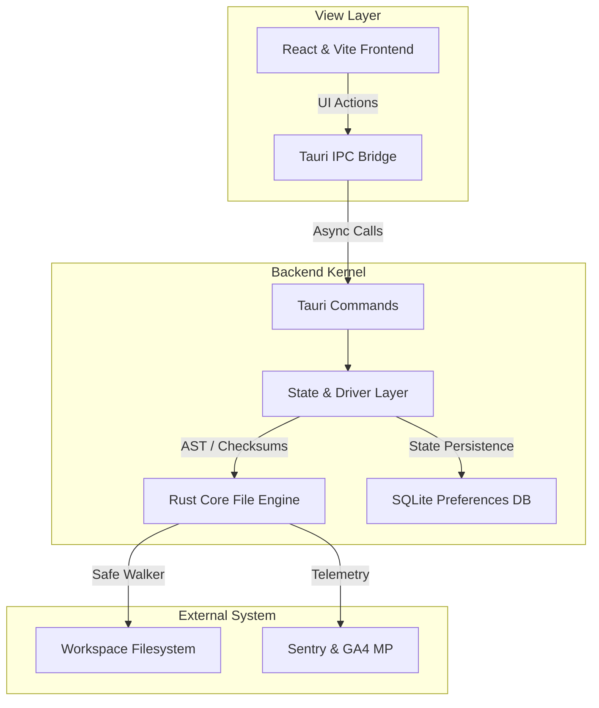

# HANGER — AI Flight Deck

A high-performance, local-first visual flight control deck for the local AI developer environment. Built with Tauri v2, Vanilla TypeScript, and styled in a clean clinical notebook design system.

## Architecture

Hanger uses a multi-tiered architecture to isolate visual presentation from filesystem mutations:




## Local Development (Bun)

To run the application in a hot-reloading development environment, ensure you have **Bun** and **Rust** installed, then run:

```bash
# 1. Install dependencies
bun install

# 2. Run the application dev frame
bun run tauri dev
```

To build the production desktop bundle:
```bash
bun run tauri build
```

## Asset Reaping Safeguards (`HANGER_ENABLE_REAP`)

The asset reaping engine automatically cleans up stale database records when a root scan completes and assets previously recorded under that root no longer exist on disk.

- **Status:** **Disabled by default.**
- **Rationale:** Automatic reaping is strictly gated behind the environment variable `HANGER_ENABLE_REAP` because two data-loss incidents occurred prior to gating (where transient filesystem unmounts or partial directory walks caused valid assets to be prematurely reaped from the database).
- **How to enable:** To opt in to automatic stale-asset cleanup during scans, launch the application with the environment variable set to `1`:
  ```bash
  HANGER_ENABLE_REAP=1 bun run tauri dev
  ```

