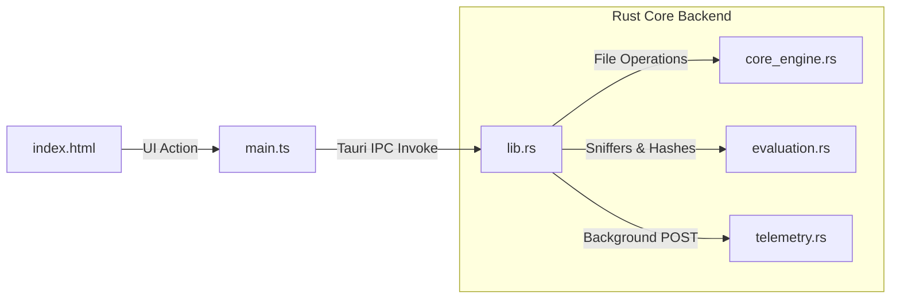

# Hanger MVP Walkthrough

This document details the completed implementation of the **Hanger** desktop flight deck application. The architecture implements the separation of visual web layouts from secure OS-level file mutations.

---

## 1. Accomplished Features & Architecture

The application has been fully scaffolded, configured, and successfully compiled.

- **Tier 1: View Layer (`index.html` & `src/styles.css`):**
  - Clinical matte-white interface featuring thin 1px `#EEEEEE` dividers and minimal chrome.
  - Sizing contrasts, desaturated moss green accenting (`#4A5D4E`), and mechanical serif typography (`Arvo`).
  - Locally served variable font **Haskoy** (`Haskoy-variable.woff2`) as the primary sans-serif typeface across all controls.
  - Persistent segmented view selectors toggling between "My Machine" and "Discovery" modes.
- **Tier 2: Communication Layer (`src/main.ts` & `src-tauri/src/lib.rs`):**
  - Fully integrated async Tauri invoke triggers with structured JSON inputs/outputs.
  - Native macOS Dialog Integration: Integrates `@tauri-apps/plugin-dialog` to invoke native folder selection windows directly on clicking "+ Add Workspace Root", replacing the manual input modal.
- **Tier 3: State & Driver Layer (`src-tauri/src/evaluation.rs`):**
  - Implements YAML frontmatter metadata extraction from `SKILL.md` manifests.
  - Implements SHA-256 deterministic checksum compilers for version drift tracking.
  - Heuristically sniffs draft scripts for active environment dependencies (`process.env`, `os.environ`) and runtime engines (`bun`, `python`, `uv`).
- **Tier 4: Core Layer (`src-tauri/src/core_engine.rs`):**
  - Recursively walks active workspace directories using `WalkBuilder` from the `ignore` crate, honoring `.gitignore` rules to bypass heavy resource bins.
  - Transactional backup protocol that stores copy logs under `.hanger/backups/[timestamp]_filename.bak` before atomic temporary writes and file swaps.
  - Safe Unix/Windows OS symlinking wrappers.

---

## 2. Visual Identity & Brand Restoration

The original documentation folder (`docs/`) has been rebuilt with the PRD document and an updated application logo matching the Granola aesthetic.

### App Logo

---

## 3. Testing and Validation Results

- **Rust Backend Compilation:** Tested using `cargo check` and `cargo build`. Dependencies compiled successfully with zero compiler warnings and errors.
- **Frontend Packaging:** Executed `bun run build`. The Vite compiler transformed the modules and successfully packaged output assets to `dist/` in 126ms.
