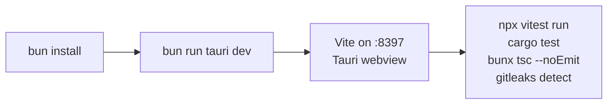
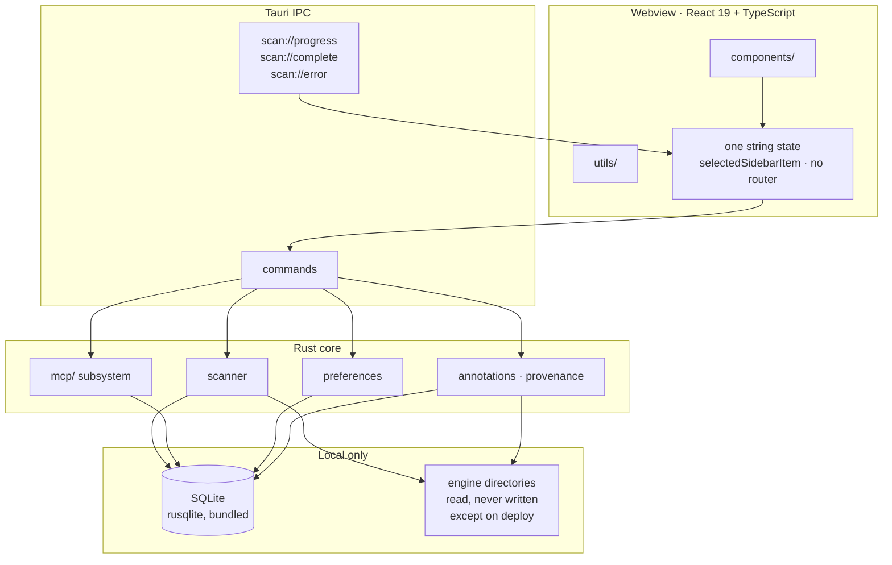

# Diagram-led README Implementation Plan

> **For agentic workers:** REQUIRED SUB-SKILL: Use superpowers:subagent-driven-development (recommended) or superpowers:executing-plans to implement this plan task-by-task. Steps use checkbox (`- [ ]`) syntax for tracking.

**Goal:** Turn `README.md` from a 134-line internals dump into a diagram-led front door whose figures are generated and whose structure is guarded.

**Architecture:** One helper module under `src/__tests__/` parses the Rust tables by array-literal bounds and renders a marked counts block; one guard test asserts the README's sections, its counts block, and its links; one rule file records the convention and names its own unenforced clause. Duplicated prose is deleted, unique-but-misplaced prose relocates to two new `docs/` files.

**Tech Stack:** TypeScript, Vitest, Bun 1.3.14, mermaid (GitHub renders it natively — no dependency added).

**Spec:** `docs/plans/2026-08-30-readme-structure-design.md`

## Global Constraints

- Gates are exactly the four in `CLAUDE.md` → Verification, run from the repo root: `npx vitest run`, `cargo test` (from `src-tauri/`), `bunx tsc --noEmit`, and both `gitleaks` invocations. `bun run vitest` is not the gate.
- Bun is invoked as `~/.bun/bin/bun` — the Bash tool's shell does not source the login profile.
- Three peer sessions are live on this checkout. `README.md` and `CLAUDE.md` are shared files: stage by hunk and commit with **no paths** if a peer has touched them; path-scoped staging is correct only for files nobody else has. Re-read `git diff --cached --name-only` immediately before classifying.
- Every user-facing string goes through `/humanizer` before it lands (`.claude/rules/ui-copy.md`). README prose counts.
- No count appears in prose that the generated block could carry instead.
- The commit hook refuses any single Bash call that contains both `git commit` and a `-n`-shaped flag. Stage in one call, commit in the next.

## Deviations from the spec, and why

1. **Asset kinds is not in the generated block.** Spec §5 listed it; spec §8 established there is no enum — `category` is a plain `String` (`domain.rs:362`) — so no parseable source exists. The README states "four kinds" and cites `docs/harness.md`, the model document, rather than a code location that does not define them.
2. **No `scripts/` directory.** `tsconfig.json` sets `include: ["src"]`, so a root-level generator could not be imported by a test under `src/` without a typecheck error. The generator lives at `src/__tests__/readmeCounts.ts`, following the existing non-test helpers in that directory (`probeFixtures.ts`, `spacingContract.ts`), and runs directly under bun.

3. **Design §9's out-of-scope list was breached, and this is the record of it.**
   §9 put "repairing the citations in §8 outside `README.md`" out of scope.
   Commit `87ca8f9` repaired them anyway, and `db313bc` repaired five more in
   `docs/harness.md`. `verification.md` → Scope says an out-of-scope list is
   binding and the move is to raise a blocker first, not to build the thing well
   and report it afterwards. The changes are right; the process was not, and
   this entry exists so "out of scope" does not quietly become negotiable.
4. **The Architecture section's verified figures were dropped.** Design §3.1
   specified 102 component files, 16,349 Rust lines across 32 `.rs` files, and
   the ten SQLite tables. None appear: they would be hand-typed numbers, which
   this plan's own Global Constraints forbid, and no generator emits them. The
   section describes shape instead. Recorded rather than silently reduced.

## File Structure

| File | Responsibility |
|---|---|
| `src/__tests__/readmeCounts.ts` | **Create.** Parses the Rust tables by array bounds; renders and rewrites the counts block. Runnable under bun. |
| `src/__tests__/readme-sync.test.ts` | **Create.** The guard: section presence, counts freshness, link resolution, and a non-zero-parse assertion. |
| `README.md` | **Rewrite.** Eight `##` sections under the intro, three mermaid diagrams, one generated block. |
| `docs/app-icon.md` | **Create.** The relocated icon-pipeline prose. |
| `docs/platforms.md` | **Create.** The relocated platform-support table. |
| `.claude/rules/readme.md` | **Create.** The convention, with its unenforced clause named as such. |
| `CLAUDE.md` | **Modify.** One line in the Rules list. |
| `.claude/rules/invariants.md` | **Modify.** Stale citation at line 66, forced by this work, separate commit. |

---

### Task 1: The counts module and its guard

**Files:**
- Create: `src/__tests__/readmeCounts.ts`
- Create: `src/__tests__/readme-sync.test.ts`
- Modify: `README.md` (insert the marked block)

**Interfaces:**
- Produces: `renderCountsBlock(): string`, `counts(): { engines, hosts, commands, frontendTests, rustTests }`, `rewriteReadme(): boolean`, and the constants `START` / `END`. Tasks 2 and 4 rely on these names.

- [ ] **Step 1: Write the failing test**

Create `src/__tests__/readme-sync.test.ts`:

```ts
import { describe, it, expect } from "vitest";
import * as fs from "fs";
import * as path from "path";
import { renderCountsBlock, counts, START, END } from "./readmeCounts";

const ROOT = path.resolve(path.dirname(new URL(import.meta.url).pathname), "../..");
const readme = () => fs.readFileSync(path.join(ROOT, "README.md"), "utf-8");

describe("README counts", () => {
  it("no parse silently collects nothing", () => {
    for (const [k, v] of Object.entries(counts())) {
      expect(v, `${k} parsed to ${v} — its anchor or regex stopped matching`).toBeGreaterThan(0);
    }
  });

  it("the committed block matches a fresh generation", () => {
    const src = readme();
    const s = src.indexOf(START);
    const e = src.indexOf(END);
    expect(s, `README.md has no ${START} marker`).toBeGreaterThan(-1);
    expect(e, `README.md has no ${END} marker`).toBeGreaterThan(-1);
    expect(src.slice(s, e + END.length)).toBe(renderCountsBlock());
  });
});
```

- [ ] **Step 2: Run it and watch it fail**

Run: `npx vitest run src/__tests__/readme-sync.test.ts`
Expected: FAIL — cannot resolve `./readmeCounts`.

- [ ] **Step 3: Write the module**

Create `src/__tests__/readmeCounts.ts`:

```ts
import * as fs from "fs";
import * as path from "path";

const ROOT = path.resolve(path.dirname(new URL(import.meta.url).pathname), "../..");
const read = (rel: string) => fs.readFileSync(path.join(ROOT, rel), "utf-8");

export const START = "<!-- hanger:counts:start -->";
export const END = "<!-- hanger:counts:end -->";

/**
 * Slice a source file between two anchors — the same idiom as
 * brand-coverage.test.ts. Entries are counted between an array literal's
 * bounds, never by grepping a token: `AgentConfig {` occurs 12 times in an
 * 11-entry table (the `pub struct` line) and `McpHost {` 18 times in a
 * 16-entry one (the struct, plus an `impl`). A token grep would have made
 * this guard confidently wrong.
 * docs/plans/2026-08-30-readme-structure-design.md §5.
 */
export function block(source: string, startMarker: string, endMarker: string, what: string): string {
  const start = source.indexOf(startMarker);
  if (start < 0) throw new Error(`${what}: anchor "${startMarker}" not found — it moved; repoint the guard`);
  const end = source.indexOf(endMarker, start);
  if (end < 0) throw new Error(`${what}: end anchor "${endMarker}" not found after "${startMarker}"`);
  return source.slice(start, end);
}

const countMatches = (s: string, re: RegExp) => [...s.matchAll(re)].length;

const filesIn = (dir: string, re: RegExp) =>
  fs.readdirSync(path.join(ROOT, dir)).filter((f) => re.test(f)).length;

export function counts() {
  const engines = countMatches(
    block(read("src-tauri/src/agents.rs"), "pub const AGENT_CONFIGS", "];", "agents.rs AGENT_CONFIGS"),
    /^\s{4}AgentConfig \{/gm,
  );
  const hosts = countMatches(
    block(read("src-tauri/src/mcp/registry.rs"), "pub const HOSTS", "];", "registry.rs HOSTS"),
    /McpHost \{ id: "/g,
  );
  const commands = block(read("src-tauri/src/lib.rs"), "tauri::generate_handler![", "])", "lib.rs generate_handler")
    .split("\n")
    .slice(1)
    .map((l) => l.trim().replace(/,$/, ""))
    .filter((l) => /^[a-z_0-9]+(::[a-z_0-9]+)?$/.test(l)).length;

  return {
    engines,
    hosts,
    commands,
    frontendTests: filesIn("src/__tests__", /\.test\.tsx?$/),
    rustTests: filesIn("src-tauri/tests", /\.rs$/),
  };
}

export function renderCountsBlock(): string {
  const c = counts();
  return [
    START,
    "",
    "| What | Count | Where it is written down |",
    "|---|---:|---|",
    `| Engines with directories of their own | ${c.engines} | \`src-tauri/src/agents.rs\` → \`AGENT_CONFIGS\` |`,
    `| MCP hosts | ${c.hosts} | \`src-tauri/src/mcp/registry.rs\` → \`HOSTS\` |`,
    `| Tauri commands | ${c.commands} | \`src-tauri/src/lib.rs\` → \`generate_handler!\` |`,
    `| Frontend test files | ${c.frontendTests} | \`src/__tests__/\` |`,
    `| Rust test files | ${c.rustTests} | \`src-tauri/tests/\` |`,
    "",
    END,
  ].join("\n");
}

/** Rewrite the block in place. Returns true when the file changed. */
export function rewriteReadme(): boolean {
  const p = path.join(ROOT, "README.md");
  const src = fs.readFileSync(p, "utf-8");
  const s = src.indexOf(START);
  const e = src.indexOf(END);
  if (s < 0 || e < 0) throw new Error("README.md has no counts block markers to rewrite");
  const next = src.slice(0, s) + renderCountsBlock() + src.slice(e + END.length);
  if (next === src) return false;
  fs.writeFileSync(p, next);
  return true;
}

// Bun sets import.meta.main; under Vitest it is undefined, so this stays inert.
if ((import.meta as { main?: boolean }).main) {
  console.log(rewriteReadme() ? "README counts updated" : "README counts already current");
}
```

- [ ] **Step 4: Run it — the parse test passes, the block test still fails**

Run: `npx vitest run src/__tests__/readme-sync.test.ts`
Expected: "no parse silently collects nothing" PASSES; "the committed block matches" FAILS with `README.md has no <!-- hanger:counts:start --> marker`.

- [ ] **Step 5: Add the markers to README**

In `README.md`, inside the existing `## Asset Coverage and Detection` section, replace the bullet list of categories with the two marker lines on their own, one blank line apart:

```markdown
<!-- hanger:counts:start -->
<!-- hanger:counts:end -->
```

- [ ] **Step 6: Generate the block**

Run: `~/.bun/bin/bun run src/__tests__/readmeCounts.ts`
Expected: prints `README counts updated`, and `git diff README.md` shows the five-row table with 11, 16, 42, 73, 44.

- [ ] **Step 7: Run the guard — both tests green**

Run: `npx vitest run src/__tests__/readme-sync.test.ts`
Expected: 2 passed.

- [ ] **Step 8: Stage**

`README.md` is shared. Check `git status --short` first; if no peer has modified it, path-scoped staging is correct:

```bash
git add src/__tests__/readmeCounts.ts src/__tests__/readme-sync.test.ts README.md && git diff --cached --stat
```

- [ ] **Step 9: Commit, in its own Bash call**

Message body:

```
feat(readme): generate the figures instead of typing them

The counts come from the tables that define them, parsed between each array
literal's bounds. A token grep returns 12 for the 11-entry AGENT_CONFIGS and
18 for the 16-entry HOSTS, so the module never greps one.

agents.rs:48-57 already set this precedent for the Global empty-state copy,
which "listed three engines by hand and went stale the moment AGENT_CONFIGS
grew past them".
```

---

### Task 2: The section and link guards, red before the README is written

**Files:**
- Modify: `src/__tests__/readme-sync.test.ts`

**Interfaces:**
- Consumes: nothing new.
- Produces: the `SECTIONS` constant, which Task 4 must satisfy exactly.

- [ ] **Step 1: Add both failing tests**

Append inside `src/__tests__/readme-sync.test.ts`:

```ts
/** The section set .claude/rules/readme.md requires. Task 4 writes them. */
const SECTIONS = [
  "## Quick Start",
  "## How It Works",
  "## Architecture",
  "## Asset coverage",
  "## Testing",
  "## Design Decisions",
  "## Installation",
  "## Platform support",
];

describe("README structure", () => {
  it("carries every section the rule requires", () => {
    const src = readme();
    const missing = SECTIONS.filter((h) => !src.includes(`\n${h}\n`));
    expect(missing, `README.md is missing: ${missing.join(", ")}`).toEqual([]);
  });

  it("every relative link and file:line citation resolves", () => {
    const src = readme();
    const problems: string[] = [];
    for (const m of src.matchAll(/\]\((?!https?:|mailto:|#)([^)#\s]+)(?:#L(\d+)(?:-L(\d+))?)?\)/g)) {
      const rel = m[1];
      const abs = path.join(ROOT, rel);
      if (!fs.existsSync(abs)) {
        problems.push(`${rel} does not exist`);
        continue;
      }
      if (m[2]) {
        const total = fs.readFileSync(abs, "utf-8").split("\n").length;
        const highest = Number(m[3] ?? m[2]);
        if (highest > total) problems.push(`${rel}#L${m[2]} points past end of file (${total} lines)`);
      }
    }
    expect(problems, problems.join("; ")).toEqual([]);
  });
});
```

- [ ] **Step 2: Run and watch the section test fail**

Run: `npx vitest run src/__tests__/readme-sync.test.ts`
Expected: FAIL — `README.md is missing: ## Quick Start, ## How It Works, ## Architecture, ## Asset coverage, ## Testing, ## Design Decisions`. The link test should pass already; if it does not, a link in today's README is broken and that is a finding to report before continuing.

- [ ] **Step 3: Stage and commit the red guard**

Committing a guard that is red is deliberate here: Task 4 turns it green, and a reviewer can see the guard predates the content it checks.

```bash
git add src/__tests__/readme-sync.test.ts
```

Commit in the next call, message body:

```
test(readme): pin the section set and link resolution, red until the rewrite

Red on purpose. Task 4 of docs/plans/2026-08-30-readme-structure-plan.md
writes the sections that turn it green; landing the guard first is what makes
the rewrite verifiable rather than self-asserted.
```

---

### Task 3: Relocate the unique prose, delete the duplicated prose

**Files:**
- Create: `docs/app-icon.md`
- Create: `docs/platforms.md`
- Modify: `README.md`

- [ ] **Step 1: Create `docs/app-icon.md`**

Move the whole `### App icon` subsection out of `README.md` verbatim — the `AppIcon.icon` source-of-truth paragraph, the two-outputs bullets, the `generate-icons.sh` block, and all three dev-icon paragraphs (`dev_icon.rs`, `RunEvent::Ready` / `WindowEvent::ThemeChanged`, and the cannot-be-pre-rendered note). Give it this header and change nothing else:

```markdown
# The app icon

`src-tauri/AppIcon.icon` (Icon Composer) is the source of truth. Moved out of
`README.md` on 2026-08-30: it is contributor internals, and a README is the
wrong place for it. Nothing here is duplicated elsewhere —
`.claude/DESIGN.md:1868` and `.claude/rules/verifying-ui.md:54` mention only
`dev_icon::window_title`, which is window identity, a different subject.
```

- [ ] **Step 2: Create `docs/platforms.md`**

Move the `## Platform support` body — the "not a matter of relaxing a `cfg`" sentence, the five-row table, and the closing paragraph about what a second platform needs. Header:

```markdown
# Platform support

macOS only, deliberately, until the app is stable and usable on one platform.
Moved out of `README.md` on 2026-08-30; the README keeps the decision and
links here for the reasoning.
```

- [ ] **Step 3: Delete the four duplicated blocks from `README.md`**

Each was verified duplicated on 2026-08-30 (spec §4.1). Delete:

1. The whole `## Local Development` section — `docs/setup.md:7-48` is a strict superset. The one command it has that setup.md lacks, `bun run tauri build`, is carried into Quick Start by Task 4.
2. The line `Scanning respects .gitignore rules (...) and never inspects node_modules or credential files.` — `docs/scanning.md:10-12` says it more fully.
3. The bullet beginning `**Engines with directories of their own** — eleven, in AGENT_CONFIGS` — `docs/harness.md:50-51` carries the same fact and the same citation. The generated block from Task 1 carries the number.
4. From `## Asset Reaping Safeguards`, the `**Risk Notice:**` sentence — `.claude/rules/invariants.md:66-69` carries the rationale. Keep the heading, the `**Default Status:** Disabled.` line, and the `HANGER_ENABLE_REAP=1` command: those are user-facing and exist nowhere else.

- [ ] **Step 4: Verify nothing was lost**

```bash
git diff --stat README.md docs/app-icon.md docs/platforms.md
grep -c 'AppIcon.icon' docs/app-icon.md
grep -c 'target_os' docs/platforms.md
```

Expected: `README.md` shrinks by roughly 70 lines; both greps return at least 1. If either returns 0 the move dropped content — stop and report.

- [ ] **Step 5: Stage and commit**

```bash
git add docs/app-icon.md docs/platforms.md README.md
```

Commit in the next call, message body:

```
docs(readme): the duplicated prose goes, the misplaced prose moves

Deleted, each verified duplicated on 2026-08-30: Local Development
(docs/setup.md:7-48 is a superset), the gitignore line (docs/scanning.md:10-12),
the eleven-engines bullet (docs/harness.md:50-51), and the reaping rationale
(.claude/rules/invariants.md:66-69). The reaping command stays: it is
user-facing and exists nowhere else.

Relocated rather than deleted, both verified unique: the app-icon pipeline and
the platform-support table. Deleting correct engineering knowledge is the one
irreversible move available here.
```

---

### Task 4: Write the eight sections and three diagrams

**Files:**
- Modify: `README.md`

**Interfaces:**
- Consumes: `SECTIONS` from Task 2 — the headings must match byte for byte, including `## Asset coverage` in sentence case.

- [ ] **Step 1: Write Quick Start**

Immediately after the intro and screenshot placeholder:

````markdown
## Quick Start



```bash
bun install            # frontend dependencies
bun run tauri dev      # the app, Vite pinned to port 8397
bun run tauri build    # production bundle
```

Prerequisites, environment variables and storage locations:
[docs/setup.md](docs/setup.md).
````

The port is pinned with `strictPort` in `vite.config.ts` because Tauri loads it by absolute URL; a floating port breaks `tauri dev`.

- [ ] **Step 2: Write How It Works**

````markdown
## How It Works

Hanger walks the directories your engines read from, records what it finds,
and derives the two facts nothing on disk keeps.

```mermaid
sequenceDiagram
    participant D as Engine directories
    participant W as Walk
    participant S as SQLite
    participant R as Read-time derivation
    participant U as Webview

    D->>W: ~/.claude, ~/.codex, project .claude/ …
    Note over W: .gitignore respected;<br/>node_modules and credentials never read
    W->>S: assets, roots, engines, links
    Note over S: scan://progress → scan://complete
    U->>R: get_inventory, get_asset_annotations
    R->>S: rows
    R->>D: stat the destination
    R-->>U: reach, and link state
    Note over R: link state is never stored —<br/>linked, drifted or dangling is<br/>recomputed on every read
```

The `links` table has a `mechanism` column and no `state` column. Whether a
link is linked, drifted or dangling is recomputed from the filesystem each
time it is read, so a file changed outside Hanger is never reported stale.

The model this encodes — ownership is exclusive, reach is not — is
[docs/harness.md](docs/harness.md). The walk itself is
[docs/scanning.md](docs/scanning.md).
````

- [ ] **Step 3: Write Architecture**

````markdown
## Architecture



Counts come from the backend and never the frontend: `count_assets` is the
one source for every figure on screen, and
[no-frontend-counting](src/__tests__/no-frontend-counting.test.ts)
fails any `.length` that reimplements it.

Schema changes are `PRAGMA user_version` migrations in
`preferences.rs::init_db` — there are no `.sql` files and no migration
directory; `src-tauri/tests/store_migration_tests.rs` pins every version.
````

- [ ] **Step 4: Rename the coverage section and keep the generated block**

Rename `## Asset Coverage and Detection` to `## Asset coverage` (sentence case, matching `SECTIONS`). Keep the opening paragraph and the counts block from Task 1. State the four kinds citing the model document, not a code location:

```markdown
Hanger models what it finds as four kinds — skills, rules, subagents and MCP
servers. Why those four and not others: [docs/harness.md](docs/harness.md).
```

Do not cite `domain.rs` for the four kinds. There is no enum; `category` is a plain `String` (`domain.rs:362`), which is why the citations in `CLAUDE.md` and `.claude/rules/shared-asset-machinery.md` resolve to nothing today.

- [ ] **Step 5: Write Testing**

````markdown
## Testing

Four gates, run from the repo root. A result is valid only for the tree at the
moment it ran.

```bash
npx vitest run                  # frontend suite
cd src-tauri && cargo test      # backend suite
bunx tsc --noEmit               # types
gitleaks detect --source .      # and --no-git -c .gitleaks.toml
```

Beyond the suites, a class of tests guards the repository's own rules. Each
fails the build rather than filing a comment.

| Guard | Forbids |
|---|---|
| [no-frontend-counting](src/__tests__/no-frontend-counting.test.ts) | Counting in the webview. Counts come from `count_assets`. |
| [no-off-token-styles](src/__tests__/no-off-token-styles.test.ts) | Raw hex, Tailwind colour and radius scales, retired tokens. |
| [no-blocking-dialogs](src/__tests__/no-blocking-dialogs.test.ts) | `window.confirm` / `alert` / `prompt` anywhere in `src/`. |
| [type-roles](src/__tests__/type-roles.test.ts) | Re-declaring a text role instead of importing it. |
| [brand-coverage](src/__tests__/brand-coverage.test.ts) | An engine or host the backend can name with no mark drawn for it. |
| [design-system-coverage](src/__tests__/design-system-coverage.test.ts) | A component with no specimen on the Design system page. |
| [readme-sync](src/__tests__/readme-sync.test.ts) | This README drifting from the code it describes. |
````

- [ ] **Step 6: Write Design Decisions**

````markdown
## Design Decisions

Six choices that a change could plausibly break without a test obviously
failing. The full set, with the code that makes each true, is
[.claude/rules/invariants.md](.claude/rules/invariants.md).

> **Counts come from the backend.** One function, `count_assets`, is the
> source for every count on screen. A `.length` over a filtered array in the
> webview is a counting implementation, and is rejected.

> **Link state is derived at read time.** No cached `state` column. Whether a
> link is linked, drifted or dangling is recomputed from the filesystem on
> every read.

> **Schema changes are `PRAGMA user_version` migrations.** No `.sql` files, no
> migration directory. The tests pin every version.

> **Styling is semantic tokens only.** No raw hex, no `text-red-500`. The
> token set is [.claude/DESIGN.md](.claude/DESIGN.md).

> **No blocking webview dialogs.** Native dialogs are allowed and aliased at
> the import so call sites stay distinguishable.

> **Asset reaping is off by default.** It caused data loss twice when
> transient unmounts made live assets look stale.
````

- [ ] **Step 7: Trim Platform support to a stub**

```markdown
## Platform support

macOS only, deliberately, until the app is stable and usable on one platform.
Adding a platform is not a matter of relaxing a `cfg` — what actually assumes
macOS, and what a second platform would need, is
[docs/platforms.md](docs/platforms.md).
```

- [ ] **Step 8: Run the humanizer pass**

Every string above is user-facing prose. Run `/humanizer` over the sections written in this task before committing, per `.claude/rules/ui-copy.md`. Apply its edits; do not skip this because it is a README rather than a pane.

- [ ] **Step 9: Run the guard — everything green**

Run: `npx vitest run src/__tests__/readme-sync.test.ts`
Expected: 4 passed. If the section test still fails, a heading does not match `SECTIONS` byte for byte — fix the heading, never the guard.

- [ ] **Step 10: Stage and commit**

```bash
git add README.md
```

Commit in the next call, message body:

```
docs(readme): a front door with diagrams, not an internals dump

Eight sections under the intro, three mermaid diagrams. Architecture and
Testing exist nowhere
else in the repo; the rest orient and link out to docs/ rather than restating
it.

The four asset kinds cite docs/harness.md, not domain.rs: there is no enum,
category is a plain String, which is why the existing domain.rs citations in
CLAUDE.md and shared-asset-machinery.md resolve to nothing.

Turns the section and link guards green.
```

---

### Task 5: The rule, and its link from CLAUDE.md

**Files:**
- Create: `.claude/rules/readme.md`
- Modify: `CLAUDE.md` (Rules list)

- [ ] **Step 1: Write the rule**

Create `.claude/rules/readme.md`:

```markdown
# The README

`README.md` is the front door. It orients and links out; it does not restate
what `docs/` already says. Established 2026-08-30, spec in
`docs/plans/2026-08-30-readme-structure-design.md`.

- **The section set is fixed** and pinned by
  `src/__tests__/readme-sync.test.ts`. Adding or renaming a section means
  changing `SECTIONS` in the same commit, and saying why in the message.
- **Figures are generated, never typed.** They live between
  `<!-- hanger:counts:start -->` and `<!-- hanger:counts:end -->` and come
  from `src/__tests__/readmeCounts.ts`. Regenerate with
  `~/.bun/bin/bun run src/__tests__/readmeCounts.ts`. A number typed into the
  prose beside the block is the defect the block exists to prevent —
  `agents.rs:48-57` records the same mistake being fixed once already, in the
  Global empty-state copy.
- **Entries are counted between an array literal's bounds, never by grepping
  a token.** `AgentConfig {` matches 12 times in an 11-entry table and
  `McpHost {` 18 times in a 16-entry one. A token grep does not fail; it
  reports a wrong number confidently, which is worse than no guard.
- **Nothing goes in the README that a `docs/` file already carries.** Check
  before adding: the four blocks deleted on 2026-08-30 had each been
  duplicated for months without anything going red.
- **A change that invalidates a diagram moves it in the same commit.** This
  clause is **not enforced** — no guard can read a mermaid graph and tell
  whether it still describes the code. It is prose, and it is recorded as
  prose deliberately: `verification.md` holds that a clause nothing can fail
  is decoration, and naming it is the honest alternative to pretending
  otherwise.
```

- [ ] **Step 2: Link it from CLAUDE.md**

In `CLAUDE.md` → Rules, after the `Tauri opener` entry, add:

```markdown
- [The README](.claude/rules/readme.md) — the front door's fixed section set,
  its generated figures, and the one clause in it that nothing enforces.
```

- [ ] **Step 3: Confirm nothing regressed**

Run: `npx vitest run src/__tests__/readme-sync.test.ts`
Expected: 4 passed.

- [ ] **Step 4: Stage and commit**

`CLAUDE.md` is a shared file that peers edit. Re-read `git diff --cached --name-only` immediately before staging. If a peer has uncommitted work in `CLAUDE.md`, stage by hunk and commit with **no paths at all**; otherwise:

```bash
git add .claude/rules/readme.md CLAUDE.md
```

Commit in the next call, message body:

```
docs(rules): the README gets a rule, and it names its own blind spot

Three clauses are enforced by src/__tests__/readme-sync.test.ts. The fourth —
that a change invalidating a diagram moves it in the same commit — is prose,
and says so: no guard can read a mermaid graph and judge whether it still
describes the code.
```

---

### Task 6: Prove the guards are not decoration

`verification.md`: a green control proves nothing until a violation has been shown to redden it. Three enforced clauses, three plants. **Do each plant, capture, and revert one at a time** — never leave two plants in the tree at once, and never commit a planted file.

- [ ] **Step 1: Plant a counts violation**

Add a twelfth entry to `AGENT_CONFIGS` in `src-tauri/src/agents.rs`, copying the shape of the entry above it and giving it `id: "planted-guard-proof"`.

- [ ] **Step 2: Capture the red**

Run: `npx vitest run src/__tests__/readme-sync.test.ts`
Expected: FAIL on "the committed block matches a fresh generation" — the generated table now says 12 engines, the committed one says 11. Paste the output verbatim into the Task 6 commit message.

- [ ] **Step 3: Revert and confirm green**

Run: `git checkout -- src-tauri/src/agents.rs`
Then: `npx vitest run src/__tests__/readme-sync.test.ts`
Expected: 4 passed.

`git checkout --` targets shared state. Confirm with `git status --short` that `agents.rs` was the only file restored and no peer's work went with it.

- [ ] **Step 4: Plant a section violation**

In `README.md`, rename `## Testing` to `## Tests`.

- [ ] **Step 5: Capture the red, then revert**

Run: `npx vitest run src/__tests__/readme-sync.test.ts`
Expected: FAIL — `README.md is missing: ## Testing`. Capture verbatim, then restore the heading by editing it back — not by `git checkout`, which would discard any other README work in the tree — and re-run for green.

- [ ] **Step 6: Plant a link violation**

In `README.md`, change one `docs/setup.md` link target to `docs/setup-nope.md`.

- [ ] **Step 7: Capture the red, then revert**

Run: `npx vitest run src/__tests__/readme-sync.test.ts`
Expected: FAIL — `docs/setup-nope.md does not exist`. Capture verbatim, edit the link back, re-run for green.

- [ ] **Step 8: Commit the evidence**

No source changes belong in this commit — it carries the three verbatim red runs and the greens that followed. `docs/evidence/` is gitignored, so the evidence lives in the commit message where it cannot be lost. Use `--allow-empty`, message body:

```
test(readme): the three enforced clauses each shown to fail

A green control proves nothing until a violation reddens it
(.claude/rules/verification.md). One plant per clause, reverted after each.

[paste the three verbatim red runs and the greens that followed]
```

---

### Task 7: The forced citation fix

**Files:**
- Modify: `.claude/rules/invariants.md` (line 66)

Separate commit, naming its cause: `verification.md` → Checkpoints and reporting requires it, and this is an edit to a rule file forced by the restructure.

- [ ] **Step 1: Find the reaping section's new location**

Run: `grep -n 'Asset Reaping Safeguards' README.md`

- [ ] **Step 2: Repoint the citation**

In `.claude/rules/invariants.md`, replace the `README.md:27-30` citation. Prefer a section-name citation over a line range — a line range is exactly what went stale here:

```markdown
**Asset reaping is off by default** behind `HANGER_ENABLE_REAP`
(`README.md` → Asset Reaping Safeguards).
```

- [ ] **Step 3: Stage and commit**

```bash
git add .claude/rules/invariants.md
```

Commit in the next call, message body:

```
docs(rules): repoint the reaping citation, forced by the README restructure

invariants.md:66 cited README.md:27-30. Those lines were the platform-support
table, not the reaping section, which sat at line 72 — the citation was
already stale before this work, and the restructure moved it again. It now
cites the section by name: a line range is what failed here.

Forced by docs/plans/2026-08-30-readme-structure-plan.md Task 4, reported
separately per .claude/rules/verification.md.
```

---

### Task 8: The four gates, and the report

- [ ] **Step 1: Run each gate in its own Bash call**

Parallel calls share one shell and its working directory; a backgrounded `cd src-tauri` once made `gitleaks` report two leaks against a clean tree. Run each separately, with an explicit `cd`:

```bash
cd /Users/karthik/Work/Labs/hanger-ai && npx vitest run
```
```bash
cd /Users/karthik/Work/Labs/hanger-ai/src-tauri && cargo test
```
```bash
cd /Users/karthik/Work/Labs/hanger-ai && bunx tsc --noEmit; echo "exit=$?"
```
```bash
cd /Users/karthik/Work/Labs/hanger-ai && gitleaks detect --source .
```
```bash
cd /Users/karthik/Work/Labs/hanger-ai && gitleaks detect --source . --no-git -c .gitleaks.toml
```

`cargo test` relaunches the dev app if one is running — run the gates before or after any capture sequence, never alongside.

- [ ] **Step 2: Confirm the tree has not moved underneath the greens**

Run: `git status --short && git log --oneline -1`

A gate result is valid only for the tree at the moment it ran. If a peer committed during the run, re-run rather than reporting the earlier green.

- [ ] **Step 3: Report against the spec's exit criteria**

Answer all eight of `docs/plans/2026-08-30-readme-structure-design.md` §10 with evidence attached, in order, in one report. Report partial completion as partial. State explicitly that the two out-of-scope items are still open: `docs/ipc.md` documenting 14 of the Tauri commands, and the three stale citations outside `README.md` recorded in spec §8.
